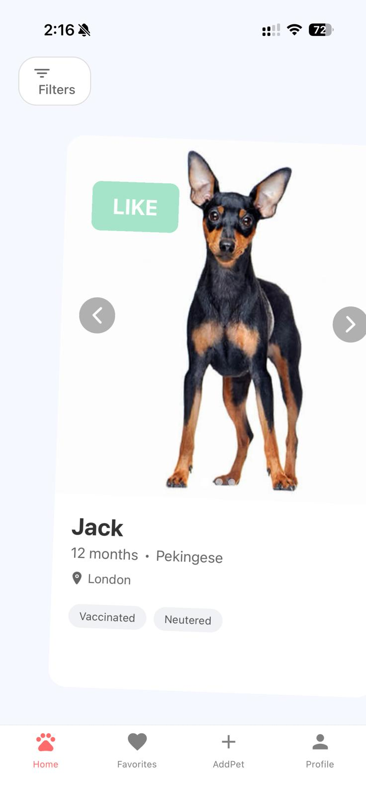
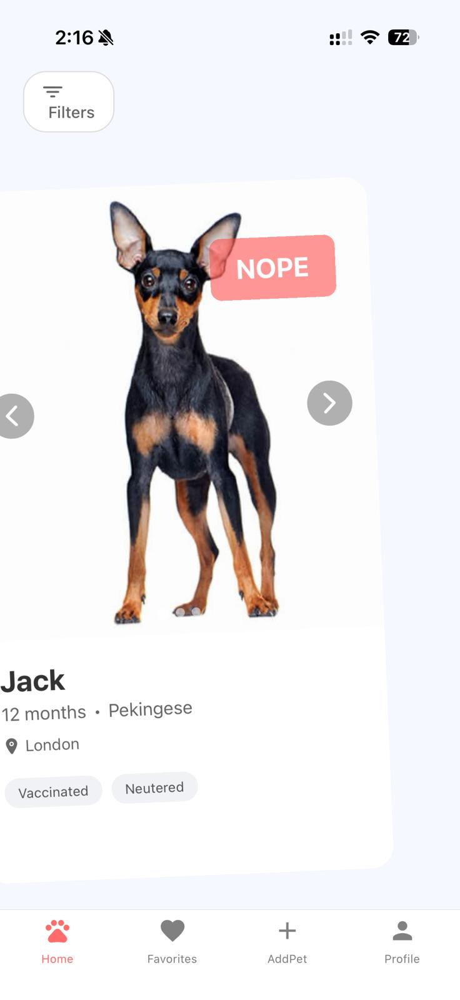
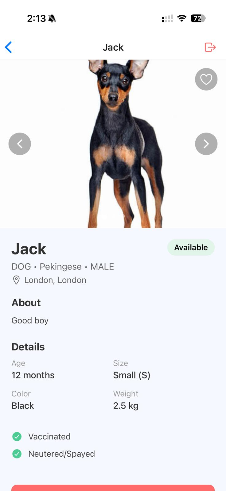
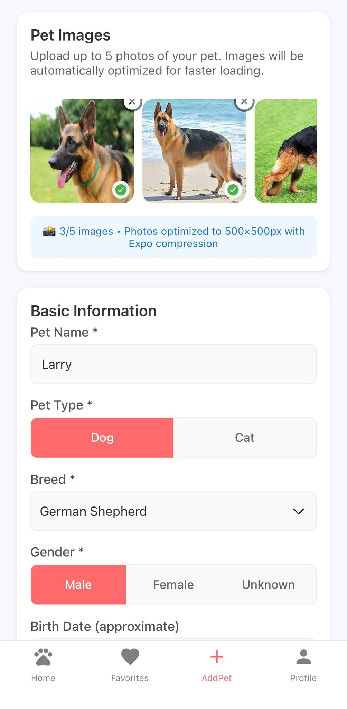
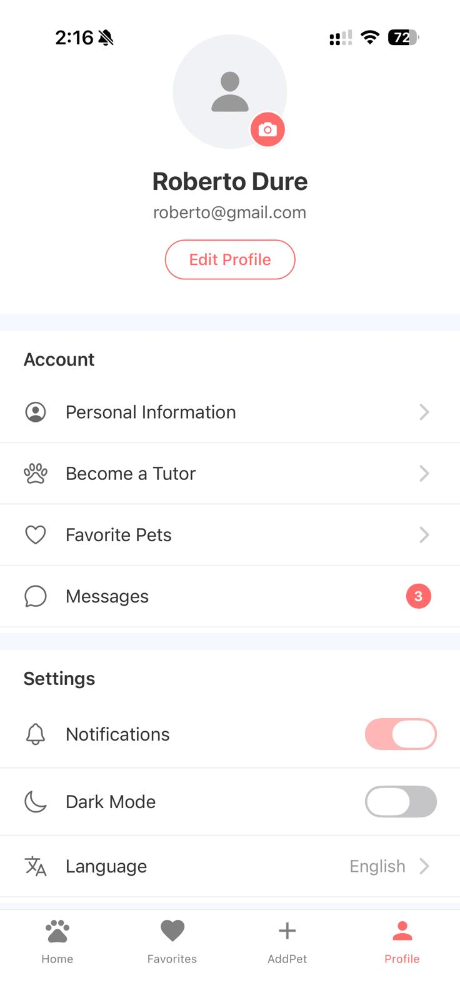

# PetFinder App

React Native + Expo mobile app that lets adopters swipe through pets, view rich profiles, save favorites, and tutors post new pets with images. Authentication, search, messaging, notifications, and location support are built in.

## Visual overview

- System flow: 
- Key screens:

| Swipe like | Swipe skip | Pet detail |
| --- | --- | --- |
|  |  |  |

| Add pet | Profile |
| --- | --- |
|  |  |

## What the app does

- Auth: login/register with token storage and refresh; protects app tabs via `AuthContext`.
- Discovery: Tinder-style swipe deck for available pets with preloaded images, like (favorite) or skip, open detail view.
- Search: list-based search with filters (name/breed/description, type, status) and quick chips.
- Details: image gallery, health flags, tutor info, adoption CTA, contact mail link, favorite toggle.
- Favorites: local favorite IDs in AsyncStorage, fetch pet data by IDs, remove favorites, pull-to-refresh, debug helpers.
- Add a pet: multi-step form with dropdowns, breed/weight catalogs, health flags, location fields, date picker, up to 5 photos with Expo image pickers and compression; creates pets with images through `PetService`.
- Profile: account info, preferences toggles, entry points for tutor upgrade, messages, favorites, logout.
- Messaging: conversations, messages, unread counts, cached in AsyncStorage.
- Notifications: Expo push registration, token storage and server sync, local notifications helpers.
- Location: fetch current position, reverse/forward geocode, nearby pets helper.

## Architecture

- Navigation: stack + bottom tabs in `AppNavigator` (tabs: Home, Favorites, AddPet, Profile; detail pushed). Auth stack shows Login/Register when no token.
- State: `AuthContext` holds auth state, tokens, user info, refresh flow. AsyncStorage persists auth and favorites.
- Services (src/services): typed API helpers on top of Axios client (`apiClient`) with token injection and retry logic. Key modules: AuthService, PetService, FavoritesService, SearchService, AdoptionService, MessagingService, NotificationService, ImagesService, LocationService.
- UI: screens under `src/screens`, swipe deck component in `components/PetSwipeCard` with Reanimated gestures and prefetching.
- Data: static catalogs (breeds, pet options) in `src/data`; images fetched via `/pets/images/{id}`.

## API expectations (Spring Boot backend)

- Backend API repo: https://github.com/RobertoDure/petfinder-api

- Base API: `/api` (configured in `src/services/apiClient.js`). Auth base is `/api/v1/auth` (`AuthService`). Update the IPs before running on device.
- Core endpoints used: pets CRUD, pets search, favorites by IDs, adoption requests, messages, notification tokens, images upload, auth login/register/refresh.

## Environment and configuration

- Expo SDK 54, React Native 0.81, React 19. Uses Reanimated, Gesture Handler, Expo Camera/Image Picker/Image Manipulator, AsyncStorage, Notifications, Location.
- Dev base URLs: change `http://192.168.0.139:8080` in `src/services/apiClient.js` and `src/services/AuthService.js` to match your backend host (use 10.0.2.2 for Android emulator; device needs your machine IP).
- Auth tokens persisted under `userToken`, `refreshToken`, `userInfo` in AsyncStorage.
- Favorites stored locally (`user_favorite_pet_ids`, `user_favorite_pets_data`) and synced by IDs.

## Key user flows

1) Sign in/up → token stored → tabs unlocked.
2) Home swipe deck → like saves to favorites; tap opens detail.
3) Detail → view gallery, health, tutor info; adoption CTA; contact mailto; favorite toggle.
4) Search → filter list; open detail.
5) Favorites → list saved pets; remove; tap to detail.
6) Add Pet → fill form, pick/compress images, submit to API with multipart/form-data.
7) Optional: notifications registration; messaging flows (conversations/messages) via services.

## Running the app

- Install: `npm install`
- Start: `npm start` (or `npm run android` / `npm run ios` / `npm run web`)
- Use Expo Go or emulator; ensure device can reach your backend IP/port (update services URLs).

## Project layout

```
petfinder-app/
├─ App.js                 # Root, providers, navigation container
├─ src/
│  ├─ navigation/         # Stack/tab setup
│  ├─ context/            # AuthContext
│  ├─ screens/            # Home, Search, Detail, Favorites, AddPet, Profile, Auth
│  ├─ components/         # PetSwipeCard (deck), shared UI
│  ├─ services/           # API clients, auth, pets, favorites, search, messaging, notifications, location, images
│  ├─ data/               # breeds catalog, pet options
│  └─ utils/              # Image utils, favorites debugger
```

## Notes and tips

- Image uploads: `PetService.createPetWithImages` expects FormData with 3+ images.
- Filtering: Home filters available pets client-side after fetching `/pets/status/AVAILABLE`.
- Preloading: swipe deck prefetches upcoming images for smoother swipes.
- Location: grant permissions before calling `LocationService.getCurrentLocation`.
- Notifications: physical device required for push; ensure Expo projectId is set.

## License

MIT
